# Route Optimization Studies - Traveling Salesman Problem


---

> Repositório dedicado a estudos de otimização de rotas com foco no Problema do Caixeiro Viajante, incluindo geração de instâncias, visualização de pontos, comparação entre algoritmos clássicos e abordagens com Machine Learning, além de análise estatística dos resultados.

Este projeto apresenta um comparativo entre um método clássico para TSP, baseado em vizinho mais próximo com refinamento 2-opt, e uma abordagem com aprendizado por reforço, explorando diferenças de qualidade de rota, tempo de execução, uso de CPU/GPU e escalabilidade.

---

## Visão geral

O repositório implementa uma pipeline experimental dividida em quatro scripts principais:

- `gerar_instancias.py`: gera instâncias euclidianas do TSP em arquivos CSV.
- `gerar_imagens_pontos.py`: lê as instâncias e gera imagens dos pontos.
- `tsp_pipeline_runner.py`: executa os algoritmos, mede distância e tempo e salva os resultados brutos.
- `tsp_analyze_results.py`: consolida os resultados, calcula estatísticas e gera tabelas e gráficos.

## Estrutura da pipeline

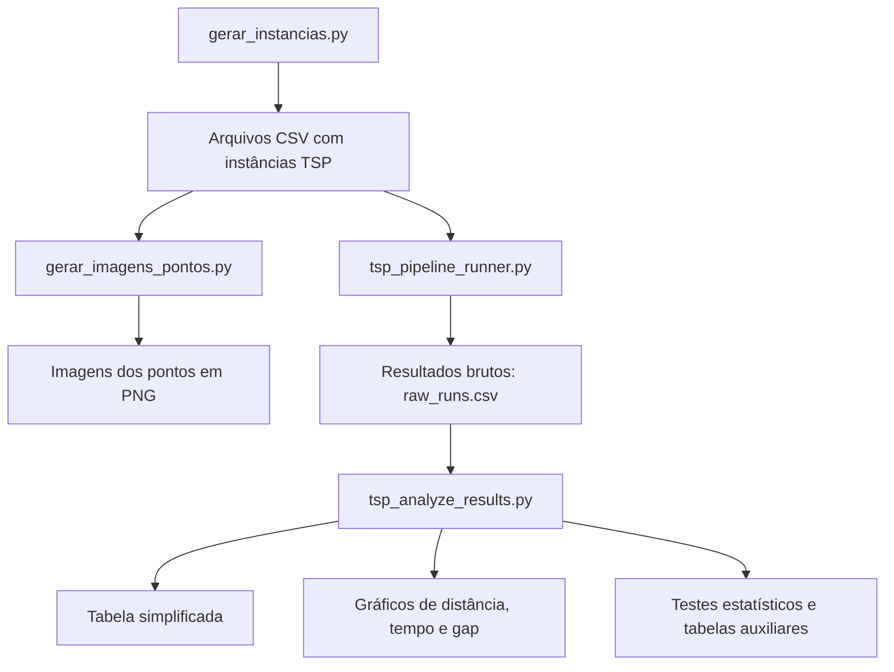

## Fluxograma detalhado dos scripts

### 1) Geração das instâncias

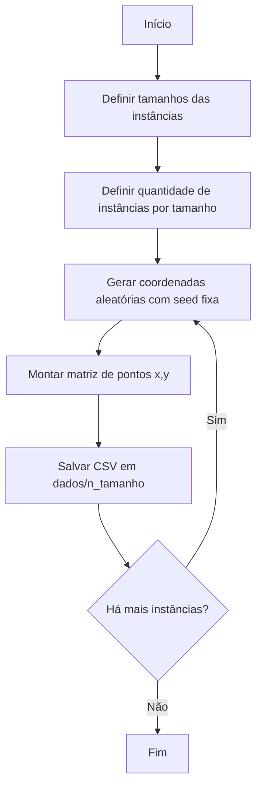

**Entrada:** parâmetros definidos no script (`tamanhos`, `instancias_por_tamanho`, `BASE_SEED`, `LIM_SUP`).

**Saída:** arquivos `instance_XX.csv` organizados por pasta de tamanho.

### 2) Geração das imagens dos pontos

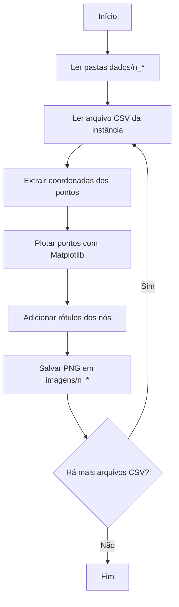

**Entrada:** instâncias CSV geradas na etapa anterior.

**Saída:** imagens PNG de cada instância.

### 3) Execução dos algoritmos e coleta de métricas

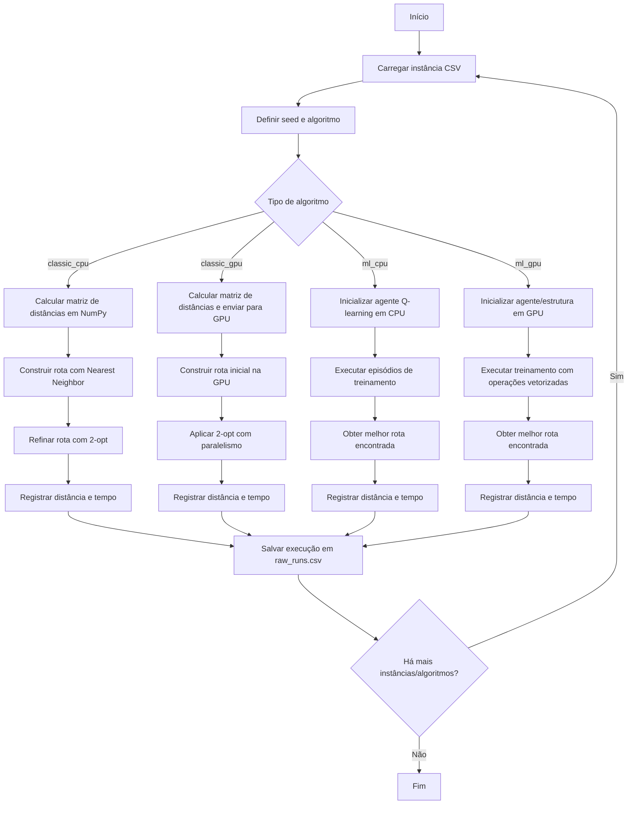

**Entradas:** instâncias CSV, parâmetros dos algoritmos, repetição por tamanho, disponibilidade de GPU.

**Saída:** arquivo `raw_runs.csv` com distância inicial/final, tempos e metadados da execução.

### 4) Análise estatística dos resultados

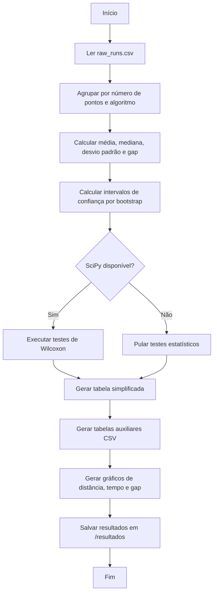

**Entrada:** `raw_runs.csv`.

**Saídas:**

- `summary_by_algorithm.csv`
- `median_distance_table.csv`
- `median_runtime_table.csv`
- `tabela_simplificada.csv`
- `wilcoxon_tests.csv` (quando disponível)
- gráficos PNG de distância, tempo, gap e boxplots

## Fluxograma dos algoritmos

### Vizinho mais próximo + 2-opt

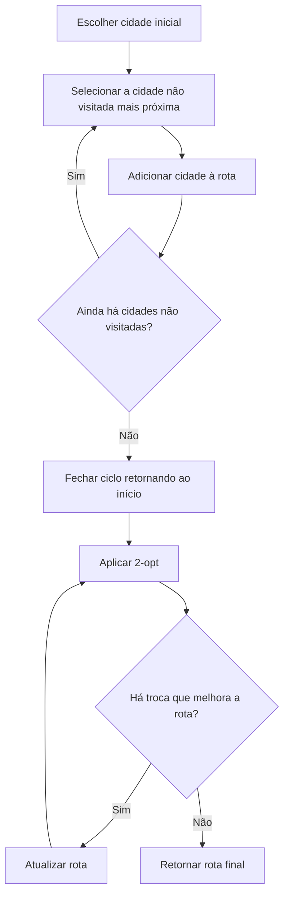

### Q-learning para construção de rota

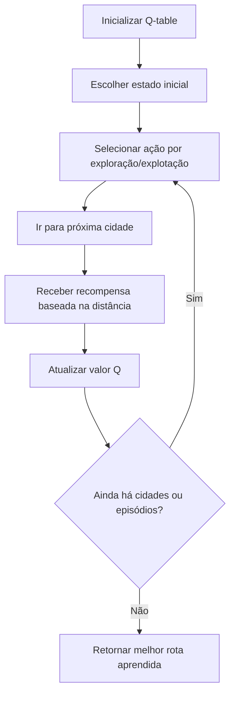

## Organização esperada de diretórios

```text
.
├── dados/
│   ├── n_10/
│   ├── n_20/
│   └── ...
├── imagens/
│   ├── n_10/
│   ├── n_20/
│   └── ...
├── resultados/
│   ├── raw_runs.csv
│   ├── tabela_simplificada.csv
│   ├── summary_by_algorithm.csv
│   ├── grafico_mediana_distancia.png
│   ├── grafico_mediana_tempo.png
│   └── ...
├── gerar_instancias.py
├── gerar_imagens_pontos.py
├── tsp_pipeline_runner.py
└── tsp_analyze_results.py
```

## Requisitos

As versões informadas das bibliotecas são:

```txt
contourpy==1.3.3
cuda-pathfinder==1.5.5
cupy-cuda12x==14.1.0
cycler==0.12.1
et_xmlfile==2.0.0
fonttools==4.63.0
kiwisolver==1.5.0
matplotlib==3.10.9
numpy==2.4.5
openpyxl==3.1.5
packaging==26.2
pandas==3.0.3
pillow==12.2.0
pyparsing==3.3.2
python-dateutil==2.9.0.post0
scipy==1.17.1
six==1.17.0
tzdata==2026.2
```

## Instalação

Crie um ambiente virtual e instale as dependências:

```bash
python -m venv .venv
source .venv/bin/activate  # Linux/macOS
# .venv\Scripts\activate   # Windows

pip install -U pip
pip install contourpy==1.3.3 cuda-pathfinder==1.5.5 cupy-cuda12x==14.1.0 cycler==0.12.1 et_xmlfile==2.0.0 fonttools==4.63.0 kiwisolver==1.5.0 matplotlib==3.10.9 numpy==2.4.5 openpyxl==3.1.5 packaging==26.2 pandas==3.0.3 pillow==12.2.0 pyparsing==3.3.2 python-dateutil==2.9.0.post0 scipy==1.17.1 six==1.17.0 tzdata==2026.2
```

## Como executar

### 1. Gerar instâncias

```bash
python gerar_instancias.py
```

### 2. Gerar imagens dos pontos

```bash
python gerar_imagens_pontos.py
```

### 3. Executar os algoritmos

```bash
python tsp_pipeline_runner.py
```

### 4. Analisar resultados

```bash
python tsp_analyze_results.py
```

## Métricas avaliadas

O pipeline compara os algoritmos com base em:

- distância inicial e final da rota;
- tempo total de execução;
- tempo de setup e tempo de solução;
- gap percentual para o melhor resultado por tamanho de instância;
- medidas de tendência central e dispersão.

## Saídas geradas

Ao final da execução, o projeto produz:

- instâncias TSP em CSV;
- imagens PNG das instâncias;
- resultados brutos de múltiplas execuções;
- tabelas resumo por algoritmo;
- gráficos de mediana de distância, tempo e gap;
- boxplots para análise de distribuição.

## Resultados visuais

Os principais gráficos gerados pelo pipeline estão disponíveis na pasta [`resultados`](https://github.com/maya-gc/Traveling-Salesman-Problem/tree/main/resultados) e resumem o comportamento dos algoritmos em termos de qualidade da rota, tempo de execução, gap para o melhor resultado e distribuição dos valores nas maiores instâncias.

### Mediana da distância por algoritmo

Este gráfico mostra como a distância mediana cresce conforme aumenta o número de pontos, permitindo comparar a qualidade das rotas entre `classic_cpu`, `classic_gpu`, `ml_cpu` e `ml_gpu`.

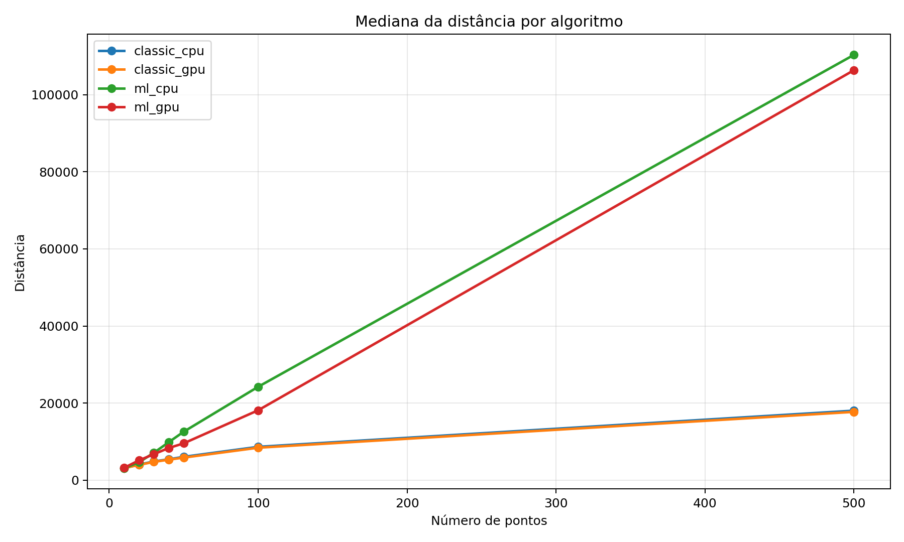

### Mediana do tempo por algoritmo

Este gráfico apresenta o custo computacional mediano de cada abordagem, evidenciando a diferença entre os métodos clássicos e os métodos baseados em aprendizado por reforço.

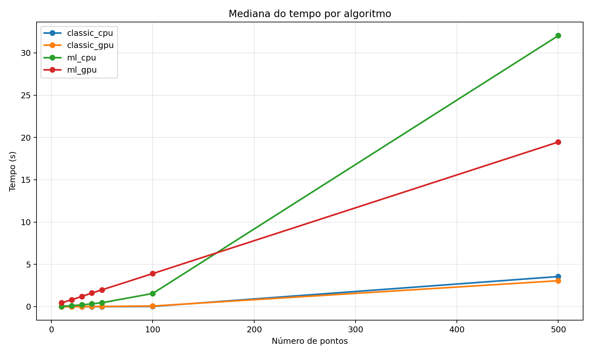

### Gap mediano para o melhor resultado

O gráfico de gap mostra o afastamento percentual de cada algoritmo em relação ao melhor resultado obtido em cada tamanho de instância, facilitando a análise comparativa de desempenho relativo.

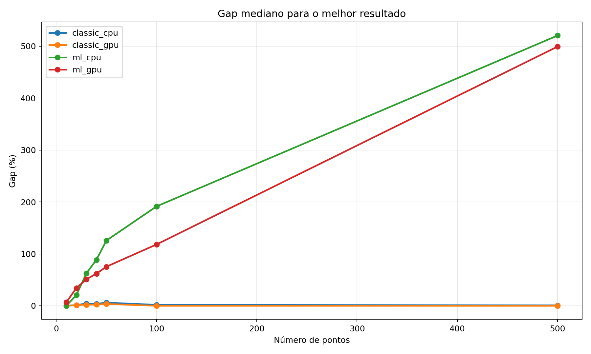

### Boxplot da distância final em n=500

Este boxplot mostra a distribuição da distância final para instâncias com 500 pontos, destacando dispersão, mediana e estabilidade de cada algoritmo.

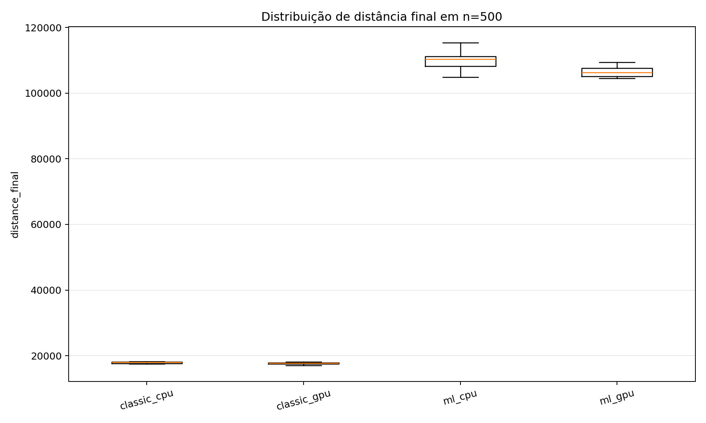

### Boxplot do tempo total em n=500

Este boxplot apresenta a distribuição do tempo total de execução em instâncias com 500 pontos, permitindo observar a variação entre CPU, GPU e métodos com ML.

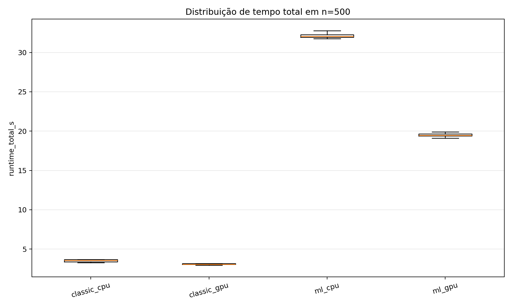

## Observações

- O script de pipeline detecta automaticamente se a GPU está disponível via CuPy.
- Caso não haja GPU compatível, a parte acelerada por GPU pode falhar ou ser ignorada dependendo do ambiente.
- O uso de seeds fixas favorece a reprodutibilidade dos experimentos.
- O projeto foi estruturado para fins experimentais e acadêmicos, com foco em comparação entre heurísticas clássicas e uma abordagem de aprendizado por reforço.

## Resumo do fluxo experimental


